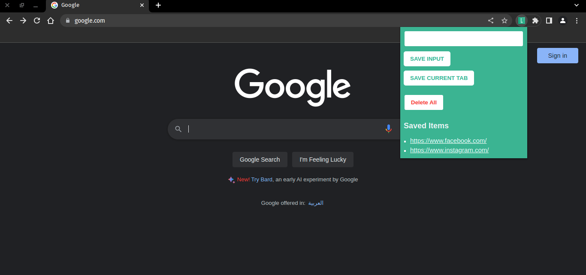
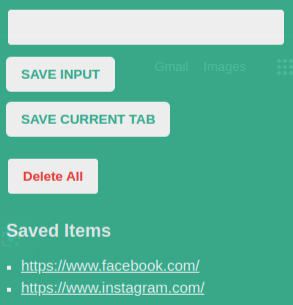

# Leads - Chrome Extension

Leads is a simple Chrome extension that allows you to save bookmarks effortlessly. You can save bookmarks either by copying the link directly or automatically using the Chrome API to access the current active tab and save it in local storage.





## Table of Contents

- [Installation](#installation)
- [Usage](#usage)
- [Features](#features)
- [Contributing](#contributing)
- [Contact](#contact)

## Installation

To install Leads, follow these simple steps:

1. Clone the repository:
   ```
   git clone https://github.com/Padfoots/leads.git
   ```

2. Open Chrome and navigate to `chrome://extensions`.

3. Enable **Developer mode** by toggling the switch in the upper-right corner.

4. Click on the **Load unpacked** button and select the cloned `leads` folder.

5. The Leads extension will now be added to Chrome.

## Usage

Once the Leads extension is installed, you can start saving bookmarks using either of the following methods:

1. **Manual Bookmarking**:
   -copy webpage link
   -click on the leads extension icon in the chrome toolbar.
   -copy the link address in the input section
   - Click **Save input** to store the bookmark.

3. **Automatic Bookmarking**:
   - Click on the Leads extension icon in the Chrome toolbar.
   - click on Save current tab
   - The extension will automatically save the current active tab as a bookmark.

## Features

- Save bookmarks manually by copying and pasting webpage links.
- Automatically save bookmarks using the Chrome API to access the current active tab.
- delete bookmarks within the Leads extension.

## Contributing

We welcome contributions to improve Leads. To contribute, please follow these steps:

1. Fork the repository and create a new branch.
2. Make your desired changes or additions.
3. Ensure your code follows the project's coding conventions.
4. Test your changes thoroughly.
5. Commit and push your changes to your forked repository.
6. Open a pull request, describing the changes you made and their purpose.

We appreciate your contributions!


## Contact

If you have any questions, suggestions, or feedback, feel free to reach out:

- Email: youssefsamir2000@gmail.com
- GitHub Issues: [https://github.com/Padfoots/leads/issues]

Happy bookmarking with Leads!
